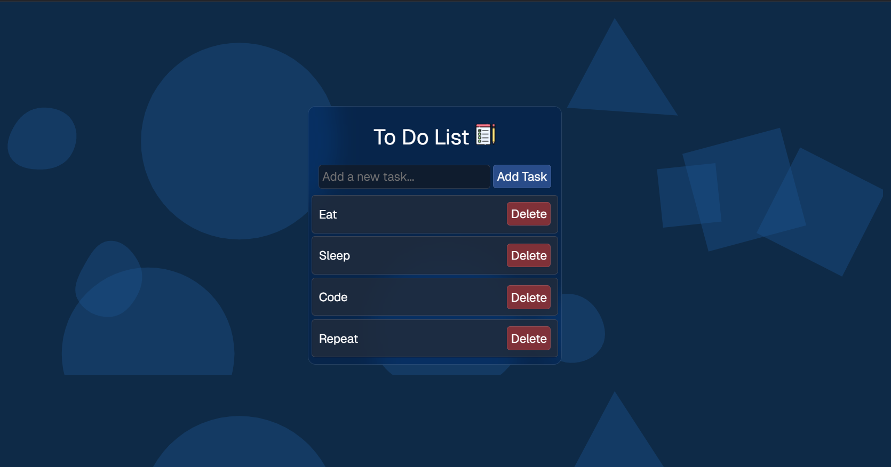

# To-Do List Application

## Overview
Welcome to the **To-Do List Application**! This is a simple yet powerful task management tool that helps you stay organized and productive. With a beautiful user interface and a seamless user experience, managing your tasks has never been easier.

## Features
- **Add Tasks**: Quickly add new tasks to your to-do list.
- **Mark Tasks as Completed**: Keep track of completed tasks with a single click.
- **Delete Tasks**: Easily remove tasks that are no longer needed.
- **Persistent Storage**: All tasks are saved to the browser's local storage, so your tasks remain even after refreshing the page.
- **Beautiful UI**: The application features a modern and visually appealing design.
- **User-Friendly Experience**: Intuitive and easy-to-use interface for a smooth experience.

## Screenshots


## Installation
1. Clone this repository to your local machine:
   ```bash
   git clone https://github.com/DevSudhanshuRanjan/todo-list.git
   ```

2. Navigate to the project directory:
   ```bash
   cd todo-list-app
   ```

3. Open `index.html` in your preferred browser to use the application.

## How to Use
1. **Add a Task**: Enter a task in the input field and click the "Add" button.
2. **Complete a Task**: Click the checkbox next to a task to mark it as completed.
3. **Delete a Task**: Click the delete icon to remove a task.
4. **Persistent Storage**: Close and reopen the browser to see your saved tasks.

## Technologies Used
- **HTML**
- **CSS**
- **JavaScript**
- **Local Storage** (for persistent task saving)

## Contributing
Contributions are welcome! If you'd like to contribute, please fork the repository and make changes as you'd like. Submit a pull request for review.

## License
This project is licensed under the MIT License.

---

Feel free to reach out with any questions or feedback. Happy tasking!

